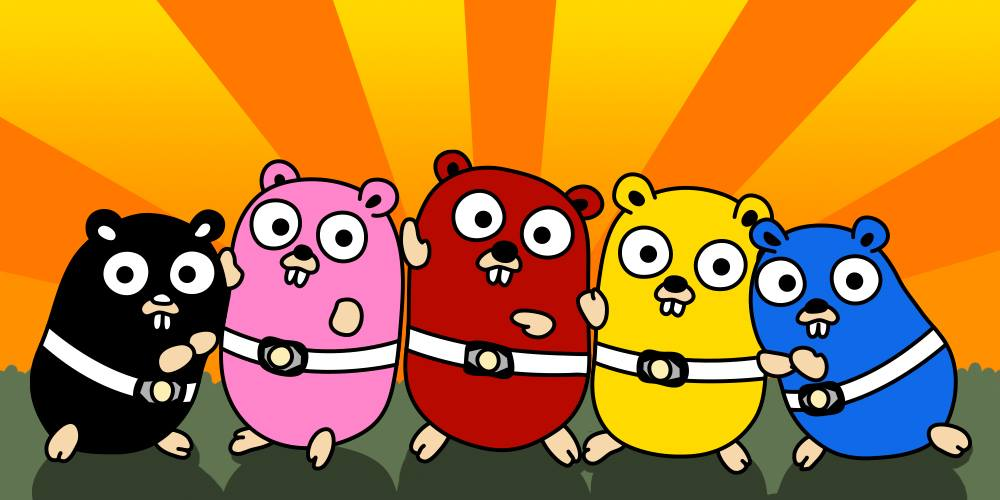

## Hey! Ho! Let's Go! 🚀

Welcome to my GitHub account! I'm Marcelo Monaco a System Engineer passionate about Go (Golang).

<!--

-->

### :technologist: About me

- :computer: I currently work in the `Big Data` area at `Santander Digital Services`.
- :nut_and_bolt: At work, I spend most of my time doing things with `Azure and Databricks`.
- :page_with_curl: In addition to being passionate about `Go`, I also love coding in `Rust`.
- :microscope: I'm looking to collaborate on `Open-Source Projects` and contribute to the developer community.

### :hearts: My likes

- :beers: I'm a beer enthusiast and love trying new craft beers, especially Imperial Stout and Barleywine. Check out my [Untappd](https://untappd.com/user/seriallink) profile for my latest finds! 
- :jp: Huge anime fan here! Evangelion is definitely my all-time favorite, but I'm always open to recommendations. Check out my [MyAnimeList](https://myanimelist.net/profile/seriallink) profile to see what I'm watching now.
- :guitar: Coding always gets better with some thrash metal and hardcore. Bands like Faith No More, Slayer, Pantera, and Hatebreed are my go-to for getting pumped.
- :dog: Proud owner of three amazing Cane Corso dogs: Odin, Poison, and Bella. They keep me active on walks and always know how to cheer me up.
- :football: Die-hard Boston Bruins and Patriots fan! You can find me glued to the TV during hockey and football season. Go Bruins! Go Pats!

<!--
https://gist.github.com/rxaviers/7360908
-->